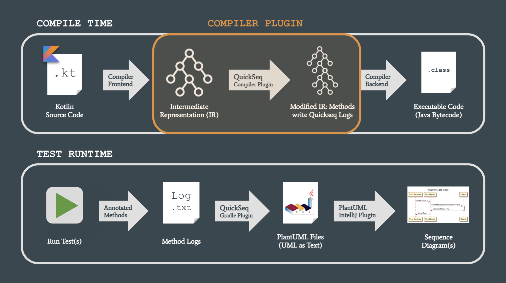

# QuickSeq

QuickSeq stands for "Quick Sequence Diagrams" and is a plugin 
for Gradle and the Kotlin IR Compiler. It comes with a set of predefined 
annotations, which you can add to your most important methods. Then, during
test runtime, the tool will automatically create logs of these methods
and convert them to [PlantUML](https://plantuml.com/sequence-diagram) sequence diagram syntax.

QuickSeq is based on 
[`debuglog` by Brian Norman](https://github.com/bnorm/debuglog),
which again is based on [`debuglog` by Kevin Most](https://github.com/kevinmost/debuglog). 
Thanks for the amazing groundwork!

---

## How it Works

During compile time, QuickSeq transforms your annotated Kotlin methods so that they can generate special logs. Then, during test runtime, the methods actually write those logs. 

When the tests have finished, the logs get translated to PlantUML syntax. You can view the diagrams with the [PlantUML Plugin for IntelliJ](https://plugins.jetbrains.com/plugin/7017-plantuml-integration).

The images were taken from [this presentation](presentation.pdf); you can take a look for a better overview.




---


## JavaDoc / KDoc

If you open [javadoc/html/plugin/index.html](javadoc/html/plugin/index.html) in a browser (after you downloaded the code), you can read the documentation of QuickSeq's classes / methods / fields without having to use an IDE.

---

## Data Security

QuickSeq itself does not send any data anywhere, but we cannot guarantee this for all of the used plugins and libraries.

---


## Setup & Usage

### (0) Adapt the Kotlin, JVM and Gradle version

**You can skip this step if the versions are compatible/equal.**

- The versions in the plugin must be compatible with the versions in your "consumer" project – otherwise the plugin will probably not work
- The safest way is to use exactly the same versions as in your consumer project
- The current versions are:
  - Kotlin: 1.4.30
  - JVM: 11
  - Gradle: 7.0.2
- You can do a full-text search to find the occurences 

### (1) Publish the Plugin to mavenLocal

- First download and open the [quickseq-annotations project](https://github.com/signavio/quickseq-annotations) and run `./gradlew publishToMavenLocal`
- Then run the file `buildAndPublish.sh` in this project

### (2) Move the JARs to your Project

- Create a directory named `libs` in your project (at the same file tree level as your `build.gradle.kts`)
- If you skipped steps (0) and (1): Download the JARs from [here](https://github.com/signavio/quickseq/releases/tag/v1.0.2)
- Else: Go to your local Maven repository (usually `.m2` at your user's root) and then to `com/kiwi/quickseq`
- Copy the following files to `libs`:
  - `quickseq-plugin/[VERSION]/quickseq-plugin-[VERSION].jar`
  - `quickseq-annotations/1.0.1/quickseq-annotations-1.0.1.jar`
  - `quickseq-annotations-jvm/1.0.1/quickseq-annotations-jvm-1.0.1.jar`
  
### (3) Import and Apply the Plugin

Go to your consumer project's `build.gradle.kts` and add the following code snippets in the given order:

If you don't have a `buildscript` block yet, create one. Otherwise, add the following lines in the proper places:
```
buildscript {
    repositories {
        flatDir {
            dirs("libs")
        }
    }

    dependencies {
        val quickseqVersion = "X.Y.Z" // Whatever version you want to use; see top-level build.gradle.kts of this project
        val quickseqAnnotationVersion = "1.0.1"
        classpath("com.kiwi.quickseq:quickseq-gradle:$quickseqVersion")
        classpath("com.kiwi.quickseq:quickseq-annotations:$quickseqAnnotationVersion")
    }
}
```


Add the `flatDir` part to your `repositories` block:
```
repositories {
    flatDir {
        dirs("libs")
    }
}
```

Add this to your `dependencies` block:
```
dependencies {
    // You must use the same versions as above!
    val quickseqVersion = "X.Y.Z" 
    val quickseqAnnotationVersion = "1.0.1"
    implementation("com.kiwi.quickseq:quickseq-annotations:$quickseqAnnotationVersion")
    implementation("com.kiwi.quickseq:plugin:$quickseqVersion")
}
```

The last part is pretty long, but luckily most IDEs allow to collapse code blocks. 😉 Add it to the root level of your build script, i.e. anywhere outside a block.

```
val diagramTask = com.kiwi.quickseq.QuickSeqDiagramTask(
    projectRootDir = file(".").absolutePath,
    generateUnfilteredDiagrams = true,
    maxRowsPerDiagram = 100
)
val generateSequenceDiagrams by tasks.registering {
    group = "documentation"
    doLast { diagramTask.generate() }
}
val clearSequenceDiagrams by tasks.registering {
    group = "documentation"
    doLast { diagramTask.clearLogsAndDiagrams() }
}

if (project.hasProperty("useQuickSeq")) {
    println("\nQuickSeq will be applied...\n")

    apply(plugin = "com.kiwi.quickseq")

    tasks.withType<KotlinCompile> {
        kotlinOptions {
            jvmTarget = "11"
            useIR = true
            apply(plugin = "com.kiwi.quickseq")
        }
    }
    
    // If you have more than one test task (e.g. test, integrationTest),
    // make sure to add the "dependsOn" and "finalizedBy" to all of them!
    tasks.test {
        dependsOn(clearSequenceDiagrams)
        finalizedBy(listOf(generateSequenceDiagrams))
    }
}
```


### (4) Annotate your Methods of Interest

There are two QuickSeq annotations:
- `@SequenceDiagram` is the "basic" annotation 
  - You can put it on any method in your code (except tests) which you would like to see in your sequence diagrams
  - The annotation has an option called ``silentReturn``: If you are not interested in the function's return value and want less arrows in your diagram, you can configure the annotation to `@SequenceDiagram(true)`. The default is `false`.
    

- `@SequenceDiagramEntryPoint` 
  - Only tests (`@Test`) can be annotated like this!
  - Per annotation, one diagram will be created – i.e. without this annotation, no diagram will be created
  - You can add a diagram title like this: `@SequenceDiagramEntryPoint("My Title")`
  

If you want all methods of a certain class or file to be logged, you can also annotate your whole class or file at once:
- `@SequenceDiagram class Foo {...}`
- `@file:SequenceDiagram` in the first line of your file (before `package`, `import` etc.)


### (5) Set Up a Run Configuration

As you could see in some of the code snippets above, the plugin only gets applied if the project has the property "useQuickSeq".

`if (project.hasProperty("useQuickSeq")) ...`

You can add this property by adding ``-PuseQuickSeq`` after your normal `./gradlew ... test` command. If you do not want to add this flag every time, I suggest you set up a run configuration in IntelliJ:


Here's an example:


### (6) Download the [PlantUML Plugin for IntelliJ](https://plugins.jetbrains.com/plugin/7017-plantuml-integration)


### (7) Run Your Tests

- If you have set up a run configuration, you can select and run it to create the diagrams.
- **You must not run your tests in parallel!**
  - Doing so would confuse the logging mechanism and your diagrams would not make sense.
- **A test run with QuickSeq does not replace a "normal" test run! (without QuickSeq)**
  - We cannot guarantee that your tests work 100% correct after they have been transformed. Actually, the body of tests which are not entry points get replaced with an empty body to run faster. Hence it means nothing if they pass.
- **Always do a Gradle clean before and after you run QuickSeq!**
  - Otherwise Gradle might take the compilation results from the build cache


---


## Concepts

### Deferred Logging / LogContext

Every function needs to print an "exit log" in order to produce a return arrow in the diagram. Sometimes this is not possible though. Consider this example:

```
ClassB {
    fun bar() {
        return foobar()
    }
}
```

It would be nice if the function did something like this:

```
ClassB {
    fun bar() {
        printEntryLog(...)
        return foobar()
        printExitLog(...)
    }
}
```

...but the `printExitLog(...)` statement would never be reached because it comes after the return. Instead, we're telling the function who called us that it should print our exit log as soon as we are done:

```
ClassB {
    fun bar() {
        printEntryLog(...)
        printExitLog(deferLogging = true, ...)
        return foobar()
    }
}
```

In this specific case, `ClassB@bar` tells `ClassA@foo`: "Hey, I have been called by you, and I need you to print my exit log as soon as I'm done here". 

Hence the transformed code of `ClassA@foo` looks somewhat like this:

```
ClassA {
    fun foo() {
        printEntryLog(...)
        ClassB().bar()
        printDeferredLogIfNeeded() // Prints exit log of ClassB@bar()
        printExitLog(...)
    }
}
```

This diagram would result from the described scenario. The gray text shows the name of the current log context.


#### Note: 

It would be nice to solve it as below, but for a yet unidentified reason, this resulted in a strange error. If you have an idea why this happens and how it can be solved, please leave a comment!

```
ClassB {
    fun bar() {
        printEntryLog(...)
        val result = foobar()
        printExitLog(...)
        return result
    }
}
```

The error: `e: java.lang.IllegalStateException: org.jetbrains.kotlin.ir.declarations.impl.IrVariableImpl@6c2481da for VAR IR_TEMPORARY_VARIABLE name:tmp0 type:[...] has unexpected parent org.jetbrains.kotlin.ir.declarations.impl.IrFunctionImpl@5ce5be31`


